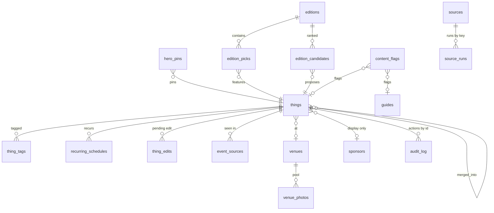

# Section 7 - Data Architecture

Ground rules applied here: the schema below is derived from "Core Project Files/sbdaymaker_schema.sql" (the canonical base, 431 lines, 13 tables) PLUS the 20 checked-in migrations in supabase/migrations/. The checked-in migrations are KNOWN-INCOMPLETE for this repo, so section 7.2 lists every table/column the in-scope code touches that appears in neither source. Do not treat the schema file alone as ground truth; the live database is ahead of the repo.

## 7.1 Schema reference

The full per-table reference (columns, types, nullability, defaults, constraints, plus the migration timeline and status-enum vocabularies) follows in section 7.7 at the end of this file. Headline structure:

- `things` is the one canonical content table (events, recurring happenings, and places distinguished by `happening_tier` 1/2/3 and `type`), with lifecycle `status` (draft, needs_review, published, archived per the base schema's thing_status enum), trust fields (`starts_at`, `last_confirmed`, `data_confidence`, `source_count`), curation fields (`hero_eligible`, `editorial_weight`), imagery (`photo_url`, `photo_source`, `photo_attribution`, `photo_options` jsonb), venue linkage (`venue_id`), zone (`nearby_zone`), dedupe (`event_key`, `merged_into`), and the sponsor fields the trust rule quarantines (`sponsor_id`, `is_featured` - the base schema comments them as display-only).
- Satellite tables: `thing_tags` (occasion tags), `recurring_schedules` (cadence rows), `thing_edits` (pending founder edits: the Queue's overlay cards), `event_sources` (dedupe provenance).
- Pipeline bookkeeping: `source_runs` (per-source run stats: the health panels), `ingest_drops` (per-run rejects: "Dropped tonight"), `sources` (the source registry SCR-03 manages), `restock_directives`, `image_spend` + `image_cache` (the Google-call budget), `audit_log` (the action ledger).
- Curation: `hero_pins`, `venues` + `venue_photos` (photo pools) + `venue_neighborhoods` (the sweep dictionary), `recurring_rhythms` (the registry SCR-05 manages).
- Edition: `editions`, `edition_picks`, `edition_candidates`; recipients in `subscribers` (the PII table; never read by any screen, only by the send path).
- Public-side tables the Cockpit touches read-only: `guides` (flag targets), `submissions` (via the worker), `shared_states` (reaper cron).

## 7.2 Schema drift: code-referenced but absent from ALL checked-in SQL

| Missing object | Touched by (file:line evidence) | Status |
|---|---|---|
| `content_flags` (whole table) | lib/flagsServer.ts line 34 `.from("content_flags")` reads id, thing_id, guide_id, reason, detail, status, created_at; API-30 updates status, resolved_at | DRIFT: no CREATE TABLE anywhere in schema.sql or migrations (the Elevation v1 Gate 1 DDL was applied to the live DB only) |
| `enrich_directives` (whole table) | app/api/admin/catalog/redraft/route.ts lines 24-31 select + insert (thing_id, status) | DRIFT: table exists only on the live DB; consumed by the worker's ingest/enrichDirectives.ts |
| `things.no_venue_ack` (column) | app/api/admin/venues/ack (API-44) writes it; lib/venuesServer.ts filters on it | DRIFT: named only in a COMMENT in supabase/migrations/20260711_images_desk.sql line 5 ("Mirrors ... things.no_venue_ack (V-4)"); no ALTER TABLE adds it |
| `things.photo_ack` (column) | API-34 (images/ack) writes it; lib/imagesServer.ts line 87 filters on it | NOT drift, but fragile: added by 20260711_images_desk.sql; lib/imagesServer.ts lines 77-89 deliberately falls back to an unfiltered scan with a console.warn if the column is missing ("run the 20260711_images_desk migration") |
| `things.slug` (column) and `url_redirects` (whole table) | API-56 approve path calls ensureSlugsForThings (lib/slug/ensureSlug.ts lines 26-45: updates things.slug, upserts url_redirects on from_path) | DRIFT: neither appears in schema.sql nor any migration (Elevation v1 Gate 2 DDL, live-DB only) |
| `editions` shape churn | base schema's editions/edition_picks were REPLACED by 20260706_edition_build.sql (new edition_status enum draft/approved/sent/skipped/failed, surrogate pick PK, candidates table) | the base schema file is stale for these tables; the migration is authoritative |

Anything else the code touches resolved cleanly to schema.sql or a migration. The pattern to flag for the downstream AI: DDL for recent features (Elevation v1 gates, images desk) was applied manually to Supabase and only sometimes committed; NEVER assume a column exists just because the schema file lacks it or vice versa.

## 7.3 Relationships

In words: everything orbits `things`. thing_tags, recurring_schedules, thing_edits, and event_sources are child rows keyed by thing_id; things.venue_id points at venues, which own venue_photos; things.merged_into self-references the dedupe survivor; things.sponsor_id points at sponsors but nothing in ranking reads it. hero_pins maps a date to a thing. editions own edition_picks and edition_candidates, both of which reference things. content_flags points at either a thing or a guide. sources (registry) relates to source_runs and to things.source by source KEY string, not a foreign key [INFERRED from code joins via sourceKeyOf()]. audit_log references entities loosely by (entity_type, entity_id). restock_directives, recurring_rhythms, venue_neighborhoods, image_spend, subscribers stand alone.

## 7.4 Read/write matrix (screen and endpoint level; column-level detail per endpoint in 07-api-backend.md)

| Table | Read by | Written by |
|---|---|---|
| things | SCR-01 (queue), SCR-02/04 (coverage/sweep), SCR-06, SCR-07, SCR-09, SCR-10, SCR-11 (targets); API-07, API-09, API-12, API-16, API-26, API-40, API-43, API-54, API-58 | API-01, API-02, API-03, API-05, API-06 (via directives), API-10, API-13, API-19, API-21, API-27, API-31, API-34, API-35, API-36, API-44, API-45, API-46, API-49, API-55, API-56, API-59, API-60; legacy actions.ts |
| thing_tags | embedded in every queue/catalog read | API-01 (add/remove_tag), API-03, API-56, API-60 |
| thing_edits | SCR-01 overlays, SCR-06 pending pill; API-58 | API-56 (mark applied), API-59 (mark rejected), API-06's worker output; worker |
| recurring_schedules | SCR-01, SCR-02, SCR-07 embeds | worker only (registry + adapters) |
| source_runs | SCR-01 sidebar + topbar counts; heartbeat cron | worker only |
| ingest_drops | SCR-01 "Dropped tonight", topbar counts | worker only |
| sources | SCR-03; confidence reasons in SCR-01 (loadSourceMetaByKey) | API-17, API-18; worker updates yield/health counters |
| audit_log | SCR-01 "Time reclaimed" metrics (action counts) | API-05, API-06, API-31, API-55, API-56, API-59, API-60, venue photo approve/remove/reorder (see per-route entries), legacy actions.ts; worker (auto_publish/auto_hold) |
| hero_pins | SCR-07 (and the PUBLIC hero via getLiveHeroPinId) | API-32 POST/DELETE |
| restock_directives | SCR-02 sidebar (API-41) | API-42; worker updates status/run_note |
| enrich_directives (drift) | API-06 (dedupe check) | API-06; worker consumes |
| venues | SCR-09, SCR-10, SCR-06 picker (via fetch routes); API-54, API-40 | API-45, API-47, API-48 (via 47), API-08/51 (auto-create/attach paths) |
| venue_photos | SCR-09 pools, SCR-10, photo pickers | API-50, API-51, API-52, API-53, API-36, API-38, API-05 (approve pool row via venue_photo_id) |
| venue_neighborhoods | SCR-04 dictionary; sweep resolver | API-11, API-13 (auto-add on triage) |
| recurring_rhythms | SCR-05 (API-15 GET) | API-14, API-15 |
| editions | SCR-08; API-24, API-25, API-28, API-29 | API-25 (chrome/status), send path (status/sent_at/sent_count) |
| edition_picks | SCR-08 | API-22, API-23, API-27 |
| edition_candidates | SCR-08 swap sheet | drafter (worker-side), API-27 (selected flags) |
| image_spend | API-33 (budget chip) | ingest/images.ts fetch paths (all Google photo calls) |
| image_cache | image waterfall internals | ingest/images.ts |
| content_flags (drift) | SCR-11 | API-30; public flag submissions (out of scope) |
| subscribers | NO screen; send path only (lib/edition/send.ts line 62) | public signup/unsubscribe (out of scope) |
| guides | SCR-11 target resolution | never from the Cockpit |
| shared_states | never read in scope | reaper cron deletes |

## 7.5 Derived / computed fields

- chip (green/amber/evergreen): chipFor(tier, starts_at), lib/review.ts lines 218-221 - tier 3 evergreen, dated green, undated amber.
- when string: whenString(), lib/review.ts lines 239-250 (dated -> sbWhen SB-local format; tier 3 -> "Evergreen · open daily"; else cadence from recurring_schedules with "time TBD" fallback).
- Queue order: prioritize(), lib/review.ts lines 257-267 - data_confidence DESC, then soonest dated, then DB order; overlay cards are prepended above everything (reviewServer.ts line 284).
- confidenceTier display buckets (>= .85 high, >= .35 mid), lib/review.ts 232-236; confidence_reasons recomputed at read time via ingest/confidence.ts confidenceReasons() (only the aggregate data_confidence is persisted; reviewServer.ts comment lines 68-70).
- Source health, two generations: rollupSources() (latest run: fail/warn/ok, lib/review.ts 381-396, feeds SCR-01) and sourceHealth() vs own baseline (below_baseline when last_yield < 34% of expected_yield, lib/review.ts 353-365, feeds SCR-02/03).
- Coverage shading: shadeColumn() with COVERAGE_FLOORS {7:3, 14:5, 30:8, 45:10} (lib/coverage.ts 39-70): relative rank within a column plus absolute floor override.
- autoPublishRatePct: audit_log counts since PHASE3_LAUNCH_DATE "2026-07-16" (reviewServer.ts 185-216).
- Hero Auto pick + pin validity: cascade() + pickAutoHero() from lib/explore.ts re-used unforked (heroServer.ts comment "the cockpit rail shows exactly what the public hero will choose"); validity = published AND hero_eligible AND occursOnDate.
- Catalog grouping keys: groupKey/groupLabel computed in lib/catalogServer.ts (day buckets and "Recurring…" groups).
- Images desk pool targets: >= 2 queue rows sharing a photo-less venue, score >= STRONG_MATCH_SCORE (20) for suggestions (ImagesView.tsx 115-129, lib/review.ts 52-58).

## 7.6 Validation rules

Client-side: filterTags negative rules (no family_day on 21+, no free_sb on paid; lib/review.ts 21-29, mirrored as disabled toggles in CMP-06/CMP-16); weight clamp [-5, +5] (CMP-03); sources form (authority numeric 0-1, label/key required; CMP-13); rhythms form (title/venue/address/sourceUrl required; CMP-15); required email/password on login. Server-side (locations in 07-api-backend.md): the same tag filter re-applied on approve/update; weight clamp re-applied in API-55; hero-pin validation via validatePin() (published + hero_eligible + occursOnDate; heroServer.ts 128-138); sources PATCH validation; editions status vocabulary checks; per-route "X required" 400s. The deliberate NON-validation: starts_at is not editable anywhere in the Cockpit (the lock note in CMP-06), so no route validates a start-time edit - there is none to validate.

## 7.7 Full table reference (from schema.sql + migrations)

Sources: `Core Project Files/sbdaymaker_schema.sql` (v9 canon base, 431 lines) plus all 20 files in `supabase/migrations/`. Column names and types are copied exactly from the SQL. Anything not literally in the SQL is tagged [INFERRED].

Naming notes against the requested list:
- "ingest_runs" does not exist; the per-run bookkeeping table is `source_runs` (20260624_ingestion.sql).
- "redraft_queue" does not exist anywhere in the SQL sources.
- "flags" / "content_flags" do not exist anywhere in the SQL sources.
- "image_budget" / "api_call_ledger" do not exist; the spend counter is `image_spend` (plus the `image_cache` companion).
- "digest_subscribers" does not exist; the table is `subscribers`.
- `event_sources` (dedupe corroboration) is included as pipeline-relevant even though it was not on the requested list.

---

### sponsors
- Defined in: schema.sql lines 103-109

| column | type | nullable | default | notes |
|---|---|---|---|---|
| id | uuid | no | gen_random_uuid() | primary key |
| name | text | no | - | |
| contact_email | citext | yes | - | |
| active | boolean | no | true | |
| created_at | timestamptz | no | now() | |

- RLS: not enabled in the SQL. Base-schema comment: hero ranker must NEVER read is_featured / sponsor_id (trust rule).

---

### things
- Defined in: schema.sql lines 114-181 (base), plus columns added by: 20260625_photo_options.sql, 20260709_card_imagery_phase2_venues.sql, 20260710_card_imagery_phase3_motif.sql, 20260711_activities.sql, 20260711_images_desk.sql, 20260716_confidence.sql, 20260718_dedupe_merge.sql

| column | type | nullable | default | notes |
|---|---|---|---|---|
| id | uuid | no | gen_random_uuid() | primary key |
| type | thing_type | no | - | enum: place, event, firstlook, happyhour |
| status | thing_status | no | 'draft' | enum: draft, needs_review, published, archived |
| title | text | no | - | |
| blurb | text | yes | - | short, AI-drafted, founder-approved |
| blurb_long | text | yes | - | detail-screen copy |
| category | text | yes | - | free text (food, music, arts, ...) |
| happening_tier | smallint | no | 3 | check (happening_tier between 1 and 3); derived from structure, stored |
| happening_category | happening_category | yes | - | AI-proposed; required at publish (app code) |
| reason_to_go | text | yes | - | required for Tier 3 (app code) |
| neighborhood | neighborhood | yes | - | granular area enum |
| nearby_zone | nearby_zone | yes | - | coarse zone for Near Me + neighborhood guides |
| address | text | yes | - | |
| lat | double precision | yes | - | |
| lng | double precision | yes | - | |
| price_band | price_band | yes | - | enum: free, $, $$, $$$ |
| free | boolean | - | - | generated always as (price_band = 'free') stored |
| indoor | boolean | no | false | weather logic |
| is_21_plus | boolean | no | false | feeds family negative-rule |
| time_of_day_fit | tod[] | no | '{}' | |
| starts_at | timestamptz | yes | - | event-only; see events_have_start check |
| ends_at | timestamptz | yes | - | |
| buy_url | text | yes | - | AXS/TM hand-off |
| place_id | text | yes | - | Google place_id (cacheable; photo is not) |
| photo_source | photo_source | no | 'placeholder' | enum incl. 'motif' after 20260710 |
| photo_url | text | yes | - | resolved URL for pexels / wikimedia / owned |
| photo_query | text | yes | - | debug / re-resolve |
| photo_attribution | text | yes | - | |
| hero_eligible | boolean | no | true | |
| editorial_weight | smallint | no | 0 | manual ranking nudge (-5..+5 per comment; no CHECK in SQL) |
| is_featured | boolean | no | false | labeled placement (Phase 2) |
| sponsor_id | uuid | yes | - | references sponsors(id) |
| last_confirmed | timestamptz | yes | - | freshness |
| source | text | yes | - | provenance key ('ticketmaster', 'seed', ...) |
| created_at | timestamptz | no | now() | |
| updated_at | timestamptz | no | now() | trg_things_updated trigger |
| photo_options | jsonb | no | '[]'::jsonb | 20260625_photo_options.sql; cockpit image-picker alternates |
| venue_id | uuid | yes | - | 20260709; references venues(id) |
| visual_kind | text | yes | - | 20260710; 'motif' or 'bigtype' or null (comment vocabulary, no CHECK) |
| visual_key | text | yes | - | 20260710; motif id, e.g. 'wharf' |
| visual_seed | integer | yes | - | 20260710 |
| activities | text[] | no | '{}' | 20260711_activities.sql |
| photo_ack | boolean | no | false | 20260711_images_desk.sql; Images-tab dismiss flag, cockpit-only |
| data_confidence | numeric(3,2) | yes | - | 20260716_confidence.sql |
| source_count | smallint | no | 1 | 20260716_confidence.sql |
| event_key | text | yes | - | 20260718; canonical event identity |
| merged_into | uuid | yes | - | 20260718; references things(id); survivor pointer for reversible merges |

- Table constraint: `events_have_start` check (type <> 'event' or starts_at is not null).
- Indexes: things_status_idx (status), things_type_idx (type), things_nearby_zone_idx (nearby_zone), things_starts_at_idx (starts_at), things_last_confirmed_idx (last_confirmed), things_hero_idx (hero_eligible) where status = 'published', things_title_trgm_idx gin (title gin_trgm_ops) for fuzzy dedupe, things_venue_idx (venue_id), things_activities_gin gin (activities), things_event_key_idx (event_key), things_merged_into_idx (merged_into) where merged_into is not null.
- RLS: enabled; policy public_read_things: select where status = 'published'. Writes are service-role only.
- [INFERRED] A column `no_venue_ack` is referenced by the 20260711_images_desk.sql comment ("Mirrors the Venues no-match catcher's things.no_venue_ack (V-4)") but no checked-in migration or base-schema line creates it. It appears to exist only on the live DB (the known migrations-tree gap).

---

### thing_tags
- Defined in: schema.sql lines 190-198

| column | type | nullable | default | notes |
|---|---|---|---|---|
| thing_id | uuid | no | - | references things(id) on delete cascade; PK part |
| tag | occasion_tag | no | - | PK part; enum extended by rainy_day (20260704) + dog_friendly (20260714) |
| confidence | numeric(3,2) | no | 1.0 | 0.00-1.00 |
| tag_source | tag_source | no | 'ai' | enum: ai, founder, rule |
| created_at | timestamptz | no | now() | |

- Primary key (thing_id, tag). Index: thing_tags_tag_idx (tag).
- Negative rules enforced in app code, not SQL: is_21_plus never gets family_day; price_band <> 'free' never gets free_sb.
- RLS: enabled; public_read_tags: select where the parent thing is published.

---

### happy_hour_windows
- Defined in: schema.sql lines 209-218

| column | type | nullable | default | notes |
|---|---|---|---|---|
| id | uuid | no | gen_random_uuid() | primary key |
| thing_id | uuid | no | - | references things(id) on delete cascade |
| day_of_week | smallint | no | - | check (day_of_week between 0 and 6); 0 = Sunday |
| starts_local | time | no | - | |
| ends_local | time | no | - | |
| deal_text | text | yes | - | |

- Unique (thing_id, day_of_week). Index: hh_windows_thing_idx (thing_id).
- RLS: enabled; public_read_hhw: select where parent thing is published.

---

### recurring_schedules
- Defined in: schema.sql lines 227-239, plus frequency column from 20260624_ingestion.sql

| column | type | nullable | default | notes |
|---|---|---|---|---|
| id | uuid | no | gen_random_uuid() | primary key |
| thing_id | uuid | no | - | references things(id) on delete cascade |
| category | happening_category | no | - | a Tier-2 value (app-validated) |
| day_of_week | smallint | no | - | check (day_of_week between 0 and 6); 0 = Sunday |
| start_time | time | yes | - | |
| end_time | time | yes | - | nullable: all-day rhythms |
| label | text | yes | - | "Wine Down Wednesday" style |
| last_confirmed | date | yes | - | freshness |
| frequency | recur_frequency | no | 'weekly' | 20260624; enum: weekly, biweekly, monthly |

- Unique (thing_id, day_of_week, category). Indexes: recurring_sched_thing_idx (thing_id), recurring_sched_dow_idx (day_of_week).
- RLS: enabled; public_read_recurring: select where parent thing is published.

---

### guides
- Defined in: schema.sql lines 247-266, plus 5 columns from 20260704_guides_content_model.sql

| column | type | nullable | default | notes |
|---|---|---|---|---|
| id | uuid | no | gen_random_uuid() | primary key |
| title | text | no | - | |
| kicker | text | yes | - | |
| intro | text | yes | - | |
| kind | guide_kind | no | 'theme' | enum: neighborhood, theme |
| zone | nearby_zone | yes | - | set for kind='neighborhood' |
| tag | occasion_tag | yes | - | set for kind='theme' |
| cover_url | text | yes | - | |
| status | thing_status | no | 'draft' | |
| created_at | timestamptz | no | now() | |
| updated_at | timestamptz | no | now() | trg_guides_updated trigger |
| stamp_code | text | yes | - | 20260704; check guides_stamp_code_ck (null or ~ '^[A-Z]{2}$') |
| refreshed_on | date | yes | - | 20260704 |
| now_note | text | yes | - | 20260704 |
| now_note_on | date | yes | - | 20260704 |
| content | jsonb | no | '{}'::jsonb | 20260704; never queried into, no index |

- Table constraint guide_scope_ck: (kind = 'neighborhood' and zone is not null) or (kind = 'theme' and zone is null).
- Indexes: guides_kind_idx (kind), guides_zone_idx (zone) where zone is not null, guides_stamp_code_uq unique (stamp_code) where stamp_code is not null.
- RLS: enabled; public_read_guides: select where status = 'published'.

---

### guide_stops
- Defined in: schema.sql lines 268-277, plus 3 columns from 20260704_guides_content_model.sql

| column | type | nullable | default | notes |
|---|---|---|---|---|
| id | uuid | no | gen_random_uuid() | primary key |
| guide_id | uuid | no | - | references guides(id) on delete cascade |
| position | smallint | no | - | |
| thing_id | uuid | yes | - | references things(id); nullable, free-text stops allowed |
| label | text | no | - | |
| note | text | yes | - | |
| chapter | smallint | no | 1 | 20260704; check guide_stops_chapter_ck (chapter >= 1) |
| sub | text | yes | - | 20260704 |
| maps_query | text | yes | - | 20260704 |

- Unique (guide_id, position). Index: guide_stops_guide_idx (guide_id).
- RLS: enabled; public_read_guidestops: select where parent guide is published.

---

### editions
- Defined in: schema.sql lines 282-288, heavily extended by 20260706_edition_build.sql; functions in 20260707_edition_send.sql

| column | type | nullable | default | notes |
|---|---|---|---|---|
| id | uuid | no | gen_random_uuid() | primary key |
| edition_date | date | no | - | unique; permalink slug for /edition/{edition_date} |
| status | edition_status | no | 'draft' | TYPE SWAPPED by 20260706 from thing_status to edition_status (draft, approved, sent, skipped, failed) |
| approved_at | timestamptz | yes | - | base contract |
| created_at | timestamptz | no | now() | |
| edition_type | edition_type | yes | - | 20260706; enum: weekend, week_ahead |
| subject | text | yes | - | 20260706 |
| preheader | text | yes | - | 20260706 |
| greeting | text | yes | - | 20260706 |
| scheduled_send_at | timestamptz | yes | - | 20260706 |
| sent_at | timestamptz | yes | - | 20260706 |
| resend_broadcast_id | text | yes | - | 20260706 |
| sent_count | int | no | 0 | 20260706 |
| open_count | int | no | 0 | 20260706; bumped by increment_edition_open() |
| click_count | int | no | 0 | 20260706; bumped by increment_edition_click() |
| skip_reason | text | yes | - | 20260706 |

- RLS: enabled; public_read_editions was recreated by 20260706 as: select where status = 'sent' (the base "published" policy was dropped).
- Functions (20260707): increment_edition_open(p_edition_id uuid), increment_edition_click(p_edition_id uuid); language sql, atomic counters for the Resend webhook, service-role only.

---

### edition_picks
- Defined in: schema.sql lines 290-298, extended by 20260706_edition_build.sql

| column | type | nullable | default | notes |
|---|---|---|---|---|
| edition_id | uuid | no | - | references editions(id) on delete cascade |
| thing_id | uuid | no | - | references things(id) |
| slot | edition_slot | no | - | enum: hero, secondary, plus nonevent + anchor (20260706) |
| position | smallint | no | 0 | order within slot |
| override_title | text | yes | - | 20260706 |
| override_blurb | text | yes | - | 20260706 |
| override_when | text | yes | - | 20260706 |
| override_neighborhood | text | yes | - | 20260706 |
| override_local_note | text | yes | - | 20260706 |
| override_image_url | text | yes | - | 20260706 |
| cached_image_url | text | yes | - | 20260706 |
| is_manual | boolean | no | false | 20260706 |
| id | uuid | no | gen_random_uuid() | 20260706; NEW surrogate primary key |

- PK swap (20260706): composite (edition_id, thing_id) PK dropped; id became primary key; constraint edition_picks_edition_thing_uniq unique (edition_id, thing_id) preserves the no-duplicate guarantee.
- Unique partial index edition_one_hero on (edition_id) where slot = 'hero' (exactly one hero per edition; untouched by the PK change).
- RLS: enabled; public_read_editionpicks recreated by 20260706: select where the parent edition status = 'sent'.

---

### edition_candidates
- Defined in: 20260706_edition_build.sql

| column | type | nullable | default | notes |
|---|---|---|---|---|
| id | uuid | no | gen_random_uuid() | primary key |
| edition_id | uuid | no | - | references editions(id) on delete cascade |
| slot | edition_slot | no | - | |
| thing_id | uuid | no | - | references things(id) |
| rank | int | no | - | 0 = best |
| selected | boolean | no | false | |

- Unique (edition_id, slot, thing_id). Index: edition_candidates_edition_idx (edition_id, slot, rank).
- RLS: enabled, NO public policy (cockpit-only bench, never rendered publicly).

---

### submissions
- Defined in: schema.sql lines 305-316

| column | type | nullable | default | notes |
|---|---|---|---|---|
| id | uuid | no | gen_random_uuid() | primary key |
| kind | submission_kind | no | - | enum: event, business |
| status | submission_status | no | 'new' | enum: new, parsed, approved, rejected, spam |
| raw_payload | jsonb | no | - | as-submitted, incl. pasted IG caption |
| submitter_name | text | yes | - | PII |
| submitter_email | citext | yes | - | PII |
| consent | boolean | no | false | |
| parsed_thing_id | uuid | yes | - | references things(id); set when approved -> draft thing |
| created_at | timestamptz | no | now() | |

- Index: submissions_status_idx (status).
- RLS: no public policy (service-role only); base-schema note says public INSERT happens via a server action or a tightly-scoped insert-only policy added when wiring forms (audit B10). Note: RLS is NOT explicitly enabled on this table in schema.sql (only the policy comment covers it) [INFERRED from absence in the alter table list at lines 391-398].

---

### subscribers
- Defined in: schema.sql lines 323-332; enum extended by 20260706_edition_build.sql

| column | type | nullable | default | notes |
|---|---|---|---|---|
| id | uuid | no | gen_random_uuid() | primary key |
| email | citext | no | - | unique; the ONLY end-user PII boundary |
| status | subscriber_status | no | 'pending' | enum: pending, confirmed, unsubscribed, plus bounced + complained (20260706) |
| confirm_token | uuid | no | gen_random_uuid() | double opt-in |
| unsubscribe_token | uuid | no | gen_random_uuid() | one-click unsubscribe |
| consented_at | timestamptz | yes | - | |
| confirmed_at | timestamptz | yes | - | |
| created_at | timestamptz | no | now() | |

- RLS: no public policy; service-role only (same caveat as submissions: not in the explicit enable list) [INFERRED].

---

### shared_states
- Defined in: schema.sql lines 347-356; kind enum extended by 20260628_shared_plan.sql

| column | type | nullable | default | notes |
|---|---|---|---|---|
| token | text | no | - | primary key; opaque unguessable URL key |
| kind | shared_state_kind | no | - | enum: save_restore, shared_list, plus shared_plan (20260628) |
| payload | jsonb | no | - | |
| email | citext | yes | - | save_restore delivery only; NULL for shared_list |
| created_at | timestamptz | no | now() | |
| last_accessed_at | timestamptz | no | now() | sliding expiry; reaper sweeps idle records |

- Indexes: shared_states_kind_idx (kind), shared_states_last_access_idx (last_accessed_at).
- RLS: no public policy; read by token server-side only.

---

### audit_log
- Defined in: schema.sql lines 361-371

| column | type | nullable | default | notes |
|---|---|---|---|---|
| id | uuid | no | gen_random_uuid() | primary key |
| entity_type | text | no | - | 'thing', 'edition', 'guide', 'submission' (comment vocabulary, no CHECK) |
| entity_id | uuid | yes | - | |
| action | text | no | - | 'ai_draft', 'approve', 'rule_override', ... (comment vocabulary, no CHECK) |
| actor | text | no | - | 'ai', 'founder', 'system' (comment vocabulary, no CHECK) |
| ai_confidence | numeric(3,2) | yes | - | |
| payload | jsonb | yes | - | |
| created_at | timestamptz | no | now() | |

- Index: audit_entity_idx (entity_type, entity_id).
- RLS: no public policy; service-role only.

---

### source_runs (the "ingest_runs" role)
- Defined in: 20260624_ingestion.sql

| column | type | nullable | default | notes |
|---|---|---|---|---|
| id | bigint | no | generated always as identity | primary key |
| source | text | no | - | adapter key, e.g. 'soho'; matches sources.key |
| started_at | timestamptz | no | now() | |
| finished_at | timestamptz | yes | - | |
| fetched | int | no | 0 | raw items pulled |
| qualified | int | no | 0 | passed the gate |
| dropped | int | no | 0 | failed the gate |
| landed | int | no | 0 | newly inserted (post-dedupe) |
| ok | boolean | no | true | false surfaces in the digest |
| error | text | yes | - | message if ok=false |

- Index: source_runs_started_idx (started_at desc).
- RLS: not mentioned in the migration.

---

### ingest_drops
- Defined in: 20260624_ingestion.sql

| column | type | nullable | default | notes |
|---|---|---|---|---|
| id | bigint | no | generated always as identity | primary key |
| run_id | bigint | yes | - | references source_runs(id) on delete cascade |
| source | text | no | - | |
| title | text | yes | - | best-effort title for display |
| reason | text | no | - | 'no_start', 'no_title', 'no_address', 'no_source', 'duplicate' (comment vocabulary, no CHECK) |
| detail | text | yes | - | human note |
| source_url | text | yes | - | |
| raw | jsonb | yes | - | raw candidate, for manual rescue |
| created_at | timestamptz | no | now() | |

- Index: ingest_drops_created_idx (created_at desc).
- RLS: not mentioned in the migration.

---

### image_spend (the "image_budget" role)
- Defined in: 20260625_images.sql

| column | type | nullable | default | notes |
|---|---|---|---|---|
| month | text | no | - | primary key; 'YYYY-MM' (UTC) |
| google_calls | int | no | 0 | billable Google calls this month (enforces the ~$10/mo cap) |
| over_cap | int | no | 0 | cards forced to placeholder by the cap |
| updated_at | timestamptz | no | now() | |

- RLS: not mentioned in the migration.

---

### image_cache
- Defined in: 20260625_images.sql

| column | type | nullable | default | notes |
|---|---|---|---|---|
| place_key | text | no | - | primary key; place_id, else normalized title-hood |
| photo_url | text | yes | - | |
| photo_source | text | yes | - | plain text here, not the photo_source enum |
| photo_options | jsonb | no | '[]'::jsonb | |
| attribution | text | yes | - | |
| resolved_at | timestamptz | no | now() | |

- RLS: not mentioned in the migration.

---

### restock_directives
- Defined in: 20260702_cockpit_v2.sql

| column | type | nullable | default | notes |
|---|---|---|---|---|
| id | uuid | no | gen_random_uuid() | primary key |
| scope_kind | restock_scope | no | - | enum: vibe, zone |
| scope_key | text | no | - | occasion_tag or nearby_zone value (app-validated) |
| window_days | smallint | no | 30 | check (window_days in (7,14,30,45)) |
| status | restock_status | no | 'queued' | enum: queued, running, done, failed |
| requested_at | timestamptz | no | now() | |
| started_at | timestamptz | yes | - | |
| finished_at | timestamptz | yes | - | |
| results_count | int | yes | - | rows that survived the gate and landed needs_review |
| run_note | text | yes | - | worker diagnostics |

- Index: restock_status_idx (status, requested_at desc).
- RLS: not mentioned in the migration.

---

### hero_pins
- Defined in: 20260702_cockpit_v2.sql

| column | type | nullable | default | notes |
|---|---|---|---|---|
| pin_date | date | no | - | primary key |
| thing_id | uuid | no | - | references things(id) on delete cascade |
| created_at | timestamptz | no | now() | |

- Not a parallel hero system: editions/edition_picks stay the "one approved day" artifact; a pin pre-decides the hero slot for that date.
- RLS: not mentioned in the migration.

---

### thing_edits
- Defined in: 20260702_cockpit_v2.sql

| column | type | nullable | default | notes |
|---|---|---|---|---|
| id | uuid | no | gen_random_uuid() | primary key |
| thing_id | uuid | no | - | references things(id) on delete cascade |
| payload | jsonb | no | - | only the changed fields |
| status | text | no | 'pending' | check (status in ('pending','applied','discarded')) |
| created_at | timestamptz | no | now() | |
| resolved_at | timestamptz | yes | - | |

- Unique partial index thing_edits_one_pending on (thing_id) where status = 'pending' (one pending edit per thing).
- RLS: not mentioned in the migration. Purpose: overlay for edits of LIVE things so the published row stays stable while an edit awaits review.

---

### venues (Card Imagery photo-pool venues)
- Defined in: 20260709_card_imagery_phase2_venues.sql, plus dog_friendly from 20260714_venues_dog_friendly.sql

| column | type | nullable | default | notes |
|---|---|---|---|---|
| id | uuid | no | gen_random_uuid() | primary key |
| key | text | no | - | unique; slug, e.g. 'soho-music-club' |
| display_name | text | no | - | |
| place_id | text | yes | - | Google place_id |
| lat | double precision | yes | - | |
| lng | double precision | yes | - | |
| radius_m | integer | no | 150 | |
| name_patterns | text[] | no | '{}' | lowercase match tokens |
| status | text | no | 'active' | 'active' or 'archived' (comment vocabulary, no CHECK) |
| created_at | timestamptz | no | now() | |
| updated_at | timestamptz | no | now() | trg_venues_updated trigger |
| dog_friendly | boolean | no | false | 20260714; editable at /admin/venues |

- RLS: enabled; public_read_venues: select where status = 'active'. Writes service-role only.

---

### venue_photos
- Defined in: 20260709_card_imagery_phase2_venues.sql

| column | type | nullable | default | notes |
|---|---|---|---|---|
| id | uuid | no | gen_random_uuid() | primary key |
| venue_id | uuid | no | - | references venues(id) on delete cascade |
| source | text | no | - | 'google', 'wikimedia', 'owned' (comment vocabulary, no CHECK) |
| stable_ref | text | no | - | google photo resource name, commons file title, or owned URL |
| serving_url | text | yes | - | current hotlinkable URL (google rows refreshed nightly) |
| attribution | text | yes | - | |
| approved | boolean | no | false | only approved rows ever render |
| sort_order | integer | no | 0 | |
| refreshed_at | timestamptz | yes | - | |
| created_at | timestamptz | no | now() | |

- Unique (venue_id, stable_ref). Index: venue_photos_venue_idx (venue_id) where approved.
- RLS: enabled; public_read_venue_photos: select where approved. No updated_at column by design.

---

### venue_neighborhoods (Neighborhood Sweep dictionary)
- Defined in: 20260714_venue_neighborhoods.sql (applied by hand 2026-07-13, checked in after)

| column | type | nullable | default | notes |
|---|---|---|---|---|
| id | uuid | no | gen_random_uuid() | primary key |
| name | text | no | - | |
| name_norm | text | no | - | lowercased, punctuation-stripped match key |
| neighborhood | neighborhood | no | - | 11-value enum; maps to 8 zones in code |
| place_id | text | yes | - | optional strong match to a Google Place |
| aliases | text[] | no | '{}' | alternate names seen in titles/addresses |
| created_by | text | no | 'founder' | |
| created_at | timestamptz | no | now() | |
| updated_at | timestamptz | no | now() | no trigger declared in the migration |

- Unique index venue_neighborhoods_name_norm_idx (name_norm). Index venue_neighborhoods_place_id_idx (place_id) where place_id is not null.
- RLS: enabled, no policy (service-role only). Deliberately NOT named venues: that table belongs to Card Imagery.

---

### recurring_rhythms (founder registry)
- Defined in: 20260714_recurring_rhythms.sql (applied by hand 2026-07-14, seeded from the old TS file's 4 entries)

| column | type | nullable | default | notes |
|---|---|---|---|---|
| id | uuid | no | gen_random_uuid() | primary key |
| slug | text | no | - | stable identity + dedupe key; unique index |
| title | text | no | - | |
| venue | text | no | - | |
| address | text | no | - | |
| neighborhood | neighborhood | no | - | |
| category | happening_category | no | - | a Tier-2 value |
| reason_to_go | text | no | - | |
| frequency | text | no | - | check (frequency in ('weekly','biweekly','monthly')); note: text here, not the recur_frequency enum |
| source_url | text | no | - | |
| days | jsonb | no | - | [{dow:0-6, start:'HH:MM' or null, end:'HH:MM' or null}, ...] |
| occasion_tags | occasion_tag[] | yes | - | null = seedOccasionTags(category) default; non-null = explicit override |
| active | boolean | no | true | cockpit toggle |
| created_at | timestamptz | no | now() | |
| updated_at | timestamptz | no | now() | no trigger declared in the migration |

- Unique index recurring_rhythms_slug_idx (slug).
- RLS: enabled, no policy (service-role / cockpit only). Edited via /admin/coverage/recurring-rhythms; the nightly pipeline reads this table only.

---

### sources (per-source registry + Scrapfly-era health)
- Defined in: 20260715_sources.sql (includes a 33-row seed: 31 adapters + registry + submission)

| column | type | nullable | default | notes |
|---|---|---|---|---|
| id | uuid | no | gen_random_uuid() | primary key |
| key | text | no | - | unique; matches source_runs.source / adapter.key exactly |
| label | text | no | - | |
| url | text | yes | - | |
| lane | text | no | 'structured' | 'structured', 'generic', 'render' (comment vocabulary, no CHECK) |
| parse_method | text | yes | - | 'api', 'ics', 'jsonld', 'html', 'form', 'db' (comment vocabulary, no CHECK) |
| authority | numeric(3,2) | no | 0.70 | 0-1, seeded from the old dedupe rank order |
| category_hints | text[] | no | '{}' | |
| neighborhood_hint | neighborhood | yes | - | |
| crawl_frequency | text | no | 'nightly' | 'nightly', 'weekly', 'reserve' (comment vocabulary, no CHECK) |
| expected_yield | integer | no | 0 | |
| last_ok_at | timestamptz | yes | - | |
| last_yield | integer | yes | - | |
| consecutive_empty | integer | no | 0 | |
| reliability | numeric(3,2) | no | 1.00 | |
| maintenance_burden | smallint | no | 1 | |
| status | text | no | 'active' | 'active', 'paused', 'retired', 'candidate' (comment vocabulary, no CHECK) |
| notes | text | yes | - | |
| created_at | timestamptz | no | now() | |
| updated_at | timestamptz | no | now() | no trigger declared in the migration |

- Index: sources_key_idx (key) plus the unique constraint on key.
- RLS: enabled, no policy (service-role / cockpit only).
- Seed authority range: soho 1.00 down to submission 0.30; on conflict (key) do nothing.

---

### event_sources (dedupe corroboration)
- Defined in: 20260718_dedupe_merge.sql

| column | type | nullable | default | notes |
|---|---|---|---|---|
| event_key | text | no | - | PK part |
| source_key | text | no | - | PK part; deliberately NO FK to sources(key): raw-hostname fallback keys may not match a sources row |
| first_seen | timestamptz | no | now() | |

- Primary key (event_key, source_key). Index: event_sources_event_key_idx (event_key).
- RLS: not mentioned in the migration.

---

## Migration timeline

| file | one-line summary |
|---|---|
| 20260624_ingestion.sql | Adds recur_frequency enum + recurring_schedules.frequency (with 2 seed backfills); creates source_runs and ingest_drops |
| 20260625_photo_options.sql | Adds things.photo_options jsonb (cockpit image-picker alternates) |
| 20260625_images.sql | Creates image_spend (monthly Google-photo cap counter) and image_cache (per-place resolution cache) |
| 20260628_shared_plan.sql | Adds 'shared_plan' to the shared_state_kind enum (only DB change of the Plan build) |
| 20260702_cockpit_v2.sql | Adds restock_scope + restock_status enums; creates restock_directives, hero_pins, thing_edits |
| 20260704_guides_content_model.sql | Adds stamp_code / refreshed_on / now_note / now_note_on / content to guides; chapter / sub / maps_query to guide_stops |
| 20260704_rainy_day_tag.sql | Adds 'rainy_day' to the occasion_tag enum (isolated on purpose) |
| 20260706_edition_build.sql | Creates edition_status + edition_type enums; swaps editions.status type; adds 11 edition columns; extends edition_slot with nonevent + anchor; adds edition_picks overrides + surrogate id PK; creates edition_candidates; adds bounced + complained to subscriber_status; creates the edition-media storage bucket; recreates the two edition read policies keyed on status = 'sent' |
| 20260707_edition_send.sql | Creates increment_edition_open / increment_edition_click SQL functions (atomic webhook counters) |
| 20260709_card_imagery_phase2_venues.sql | Creates venues + venue_photos, adds things.venue_id, RLS policies, trg_venues_updated |
| 20260710_card_imagery_phase3_motif.sql | Adds 'motif' to photo_source; adds things.visual_kind / visual_key / visual_seed |
| 20260711_activities.sql | Adds things.activities text[] + gin index |
| 20260711_images_desk.sql | Adds things.photo_ack (Images-tab dismiss flag) |
| 20260714_venue_neighborhoods.sql | Creates venue_neighborhoods (Neighborhood Sweep venue dictionary) |
| 20260714_recurring_rhythms.sql | Creates recurring_rhythms (founder-maintained registry, replaces the hardcoded TS file) |
| 20260714_dog_friendly_tag.sql | Adds 'dog_friendly' to the occasion_tag enum (retro check-in; was already live) |
| 20260714_venues_dog_friendly.sql | Adds venues.dog_friendly boolean (retro check-in; was already live) |
| 20260715_sources.sql | Creates the sources registry table + seeds 33 rows with authority scores |
| 20260716_confidence.sql | Adds things.data_confidence + things.source_count (retro check-in; applied 2026-07-16) |
| 20260718_dedupe_merge.sql | Adds things.event_key (Phase 1, retro) + event_sources table (Phase 4, retro) + things.merged_into (Phase 5, new) |

---

## Enums and checks

### CREATE TYPE enums (base schema unless noted)

| enum | values |
|---|---|
| thing_type | place, event, firstlook, happyhour |
| thing_status | draft, needs_review, published, archived |
| price_band | free, $, $$, $$$ |
| occasion_tag | date_night, family_day, nightlife, catch_a_show, arts_culture, outdoors_active, wine_food, free_sb, hosting_visitors, solo, + rainy_day (20260704), + dog_friendly (20260714) |
| tod | morning, afternoon, evening, late |
| photo_source | pexels, wikimedia, google, owned, placeholder, + motif (20260710) |
| tag_source | ai, founder, rule |
| happening_category | Tier 1: live_music, festival_fair, arts_theater, community_gathering, food_drink_event, sports_outdoors_event; Tier 2: weekly_special, recurring_nightlife, recurring_market, recurring_arts, recurring_outdoors; Tier 3: outdoor_activity, food_drink_spot, culture_spot, shopping_browse, scenic_chill |
| shared_state_kind | save_restore, shared_list, + shared_plan (20260628) |
| neighborhood | funk_zone, downtown, waterfront, montecito, mesa, mission_canyon, riviera, upper_state, goleta, carpinteria, other |
| nearby_zone | funk, downtown, waterfront, montecito, mesa, goleta |
| guide_kind | neighborhood, theme |
| edition_slot | hero, secondary, + nonevent, anchor (20260706) |
| submission_kind | event, business |
| submission_status | new, parsed, approved, rejected, spam |
| subscriber_status | pending, confirmed, unsubscribed, + bounced, complained (20260706) |
| recur_frequency (20260624) | weekly, biweekly, monthly |
| restock_scope (20260702) | vibe, zone |
| restock_status (20260702) | queued, running, done, failed |
| edition_status (20260706) | draft, approved, sent, skipped, failed |
| edition_type (20260706) | weekend, week_ahead |

### Text-column status vocabularies with a CHECK constraint

| table.column | check |
|---|---|
| thing_edits.status | check (status in ('pending','applied','discarded')) |
| recurring_rhythms.frequency | check (frequency in ('weekly','biweekly','monthly')) |
| restock_directives.window_days | check (window_days in (7,14,30,45)) |
| guides.stamp_code | guides_stamp_code_ck: null or ~ '^[A-Z]{2}$' |
| guide_stops.chapter | guide_stops_chapter_ck: chapter >= 1 |
| things.happening_tier | check (happening_tier between 1 and 3) |
| happy_hour_windows.day_of_week, recurring_schedules.day_of_week | check (day_of_week between 0 and 6), 0 = Sunday |
| things (table constraint) | events_have_start: type <> 'event' or starts_at is not null |
| guides (table constraint) | guide_scope_ck: (kind = 'neighborhood' and zone is not null) or (kind = 'theme' and zone is null) |

### Text-column status vocabularies WITHOUT a CHECK (comment-only, app-enforced)

| table.column | comment vocabulary |
|---|---|
| venues.status | 'active', 'archived' |
| sources.status | 'active', 'paused', 'retired', 'candidate' |
| sources.lane | 'structured', 'generic', 'render' |
| sources.parse_method | 'api', 'ics', 'jsonld', 'html', 'form', 'db' |
| sources.crawl_frequency | 'nightly', 'weekly', 'reserve' |
| ingest_drops.reason | 'no_start', 'no_title', 'no_address', 'no_source', 'duplicate' |
| things.visual_kind | 'motif', 'bigtype', null |
| audit_log.entity_type / action / actor | see audit_log notes |
